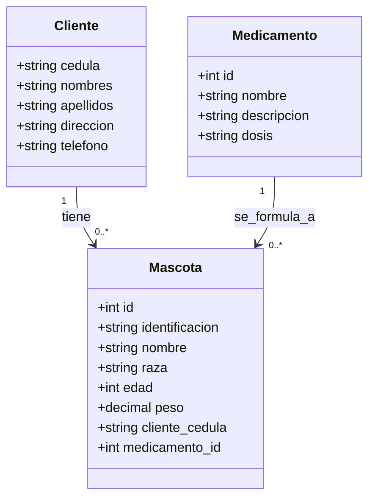

# Diagrama de clases (Mermaid)

```mermaid
classDiagram
  class Cliente {
    +string cedula
    +string nombres
    +string apellidos
    +string direccion
    +string telefono
  }

  class Medicamento {
    +int id
    +string nombre
    +string descripcion
    +string dosis
  }

  class Mascota {
    +int id
    +string identificacion
    +string nombre
    +string raza
    +int edad
    +decimal peso
    +string cliente_cedula
    +int medicamento_id
  }

  Cliente "1" --> "0..*" Mascota : tiene
  Medicamento "1" --> "0..*" Mascota : se_formula_a
```
